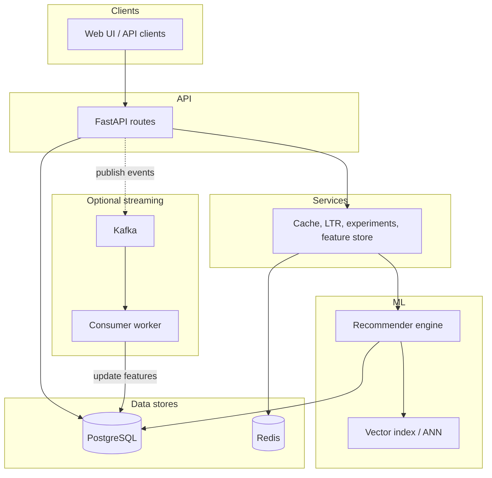

# Production Recommendation System

**Netflix / Amazon–style recommendations API** — hybrid collaborative + content + latent factors, learning-to-rank, real-time events, and experimentation. I built it with **FastAPI**, **scikit-learn**, and **PostgreSQL**.

[](https://www.python.org/)
[](https://fastapi.tiangolo.com/)
[](https://scikit-learn.org/)
[](LICENSE)
[]()

> ⭐ **If this repo helps you, a star would mean a lot.**

---

## Overview

I wanted a **production-style recommendation backend**, not a one-off notebook: users and items in Postgres, ratings and events driving the models, and APIs that return **Top-N recommendations** and **similar items** — the same class of problem Netflix, Amazon, and Spotify work on.

I went beyond a minimal demo: **Redis caching**, **optional Kafka**, **Prometheus metrics**, **A/B + bandit experiments**, **offline evaluation**, and a **Docker Compose** stack so the whole pipeline runs locally end to end.

---

## Why I built this

- **Architecture:** I structured it like real systems — candidate generation → ranking → logging → metrics — so the codebase stays explainable in interviews and on my resume.
- **Depth:** I implemented hybrid models, cold start, streaming-style events, and evaluation hooks because those topics keep coming up in ML engineering roles.
- **Room to grow:** The ML, services, and API layers are split so I can swap in deep learning or a dedicated vector DB without rewriting everything.

---

## Features

Here’s what I implemented end to end:

### Machine learning

- User-based and item-based **collaborative filtering** (cosine similarity)
- **Content-based** retrieval (TF-IDF over genre, tags, description)
- **Matrix factorization** via truncated SVD
- **Hybrid** scoring with time-decay, confidence weighting, and diversity-aware re-ranking
- **Approximate nearest neighbors** for similar items (FAISS when installed; sklearn fallback)
- **Learning-to-rank** layer (gradient boosting) to rerank `v2` candidates
- **Cold start:** popularity / content fallbacks for new users and items

### Backend

- **FastAPI** REST API with validation and OpenAPI docs
- **PostgreSQL** + **SQLAlchemy** ORM
- **Optional Redis** for recommendation and feature caching
- **Static web UI** at `/` plus optional **Streamlit** tester
- **Alembic** migrations for schema versioning

### Infrastructure & observability

- **Dockerfile** + **docker-compose** (API, Postgres, Redis, Kafka, Zookeeper, Prometheus, Grafana)
- **Prometheus** metrics at `/metrics`
- **Kafka** (optional) for event streaming + **consumer worker** for rolling feature updates

### Experimentation

- **A/B** variants (`v1` / `v2`) and experiment summaries
- **Thompson Sampling** bandit for `strategy=auto` (configurable)
- **Event logging** (impressions, clicks, watches) for online KPIs
- **Offline** Precision@K, Recall@K, MAP@K, NDCG@K, Coverage@K

---

## System Architecture



**How a request flows:** user id → load history and catalog → **candidate generation** (several retrievers) → **ranking** (hybrid + LTR on `v2`) → Top-N response and impression logging.

---

## ML Pipeline

### Candidate generation

| Source | Role |
|--------|------|
| **User-based CF** | Similar users’ preferences suggest unseen items |
| **Item-based CF** | Items similar to what the user already liked |
| **Content-based** | TF-IDF similarity from text metadata |
| **Matrix factorization (SVD)** | Latent factors for denser scoring on sparse matrices |
| **ANN / vector index** | Fast neighborhood search over item embeddings (content space) |

### Ranking

- **Hybrid** combination of retriever scores with **dynamic weights** (activity-aware)
- **Re-ranking:** popularity vs novelty, simple **genre diversity** cap
- **LTR (v2):** pointwise gradient boosting regressor trained on ratings; blends with base scores

### Cold start

- **New user:** popular / global signals until enough interactions exist  
- **New item:** content similarity when collaborative signals are weak  

---

## Real-Time System

- **`POST /events/interaction`** — `impression`, `click`, `watch` with optional watch duration  
- **`user_features`** table + Redis hash for rolling **click / impression / watch / last_active**  
- **Kafka (optional):** API can publish events; **`scripts/run_kafka_consumer.py`** applies stream updates (skips double-apply when `feature_applied` is set)  
- **`POST /jobs/precompute`** — warm caches for active users  

---

## Experimentation & Evaluation

| Area | What I shipped |
|------|------------------|
| **A/B** | `strategy=v1` vs `v2`; summaries under `/experiments/*` |
| **Bandit** | `strategy=auto` + Thompson Sampling over CTR (`ENABLE_BANDIT_AUTO`) |
| **Online** | `/experiments/performance` — impressions, clicks, watches, CTR |
| **Offline** | `scripts/evaluate_offline.py` — P@K, R@K, MAP@K, NDCG@K, coverage |

---

## Tech Stack

| Layer | Technologies |
|-------|----------------|
| **Backend** | FastAPI, Uvicorn, Pydantic |
| **ML** | NumPy, Pandas, scikit-learn; optional FAISS |
| **Data** | PostgreSQL, SQLAlchemy, Alembic |
| **Cache / queue** | Redis, Kafka (kafka-python) |
| **Observability** | prometheus-client, Prometheus + Grafana (Compose) |
| **UI** | Static frontend, Streamlit (optional) |

---

## Project Structure

```text
app/
  main.py                 # FastAPI app, metrics middleware, static UI mount
  api/routes.py           # HTTP endpoints
  db/                     # config, engine, sessions
  models/                 # ORM: users, items, ratings, events, experiments, features
  schemas/                # Pydantic request/response models
  services/               # recommendations, cache, LTR, Kafka, features, interactions
  ml/                     # recommender engine, vector index
alembic/                  # database migrations
frontend/                 # Web UI (HTML/CSS/JS)
ops/prometheus.yml        # Prometheus scrape config
scripts/
  load_sample_data.py
  evaluate_offline.py
  train_ranker.py
  run_kafka_consumer.py
docker-compose.yml
Dockerfile
postman_collection.json
requirements.txt
.env.example
LICENSE
```

---

## Setup Instructions

### 1. Virtual environment

```bash
python -m venv .venv
# Windows
.venv\Scripts\activate
pip install -r requirements.txt
```

### 2. Database

- I use a database named `recommendation_db` by default; point `DATABASE_URL` at whatever you create.
- Copy `.env.example` to `.env` and fill in `DATABASE_URL`, `REDIS_URL`, and the feature flags I documented there.

### 3. Migrations (recommended)

```bash
alembic upgrade head
```

### 4. Run backend

```bash
uvicorn app.main:app --reload
```

- **API docs:** [http://127.0.0.1:8000/docs](http://127.0.0.1:8000/docs)  
- **Web UI:** [http://127.0.0.1:8000/](http://127.0.0.1:8000/)  
- **Metrics:** [http://127.0.0.1:8000/metrics](http://127.0.0.1:8000/metrics)

### 5. Sample data

```bash
python scripts/load_sample_data.py
```

### 6. Streamlit (optional)

```bash
streamlit run streamlit_app.py
```

### 7. Docker Compose (full stack)

```bash
docker compose up --build
```

Services: API `8000`, Postgres `5432`, Redis `6379`, Kafka `9092`, Prometheus `9090`, Grafana `3000` (default admin/admin).

---

## API Overview

| Method | Path | Purpose |
|--------|------|---------|
| `GET` | `/`, `/health` | Web UI, health |
| `POST` | `/user`, `/item`, `/rate` | Create entities, submit ratings |
| `GET` | `/recommend/{user_id}` | Top-N recommendations (`strategy`: `auto`, `v1`, `v2`) |
| `GET` | `/similar/{item_id}` | Similar items |
| `POST` | `/events/interaction` | Real-time behavior events |
| `GET` | `/features/{user_id}` | Online feature snapshot |
| `GET` | `/experiments/summary`, `/performance`, `/bandit` | Experiment analytics |
| `POST` | `/jobs/precompute` | Cache warming |
| `GET` | `/metrics` | Prometheus |

Full request/response schemas live in **OpenAPI** at `/docs`.

---

## Scaling & Production Notes

What I’d do next at serious traffic: move **model rebuild** off the request path (Celery/RQ or similar), lean harder on **Redis** for hot users and TTL tuning, and rely on **Kafka + a proper stream processor** for feature freshness. I’d also add **auth**, rate limits, and **CI** that runs tests and `alembic upgrade`. For huge catalogs, I’d move ANN to a **vector DB** and rebuild indexes on a schedule.

---

## Roadmap

Things I’m interested in adding over time:

- Deep learning: **two-tower** or **NCF**-style models  
- A real **feature store** (e.g. Feast) for online/offline consistency  
- **LightGBM / XGBoost** ranking with richer behavioral features  
- **Graph** recommendations (e.g. Neo4j)  
- **Kubernetes** and staged rollouts  

---

## Contributing

Pull requests are welcome. For larger changes, open an issue first — saves duplicate work.

1. Fork the repo  
2. Branch off (`git checkout -b feature/your-topic`)  
3. Commit with a clear message  
4. Open a PR  

---

## License

Licensed under the [MIT License](LICENSE). See [`LICENSE`](LICENSE) in the repo root (Copyright (c) 2026 Aditya).

---

## Author

**Aditya Paswan**

Personal project — backend + ML + infra practice. Connect on GitHub / LinkedIn if you want to chat about recommendations or hiring.
